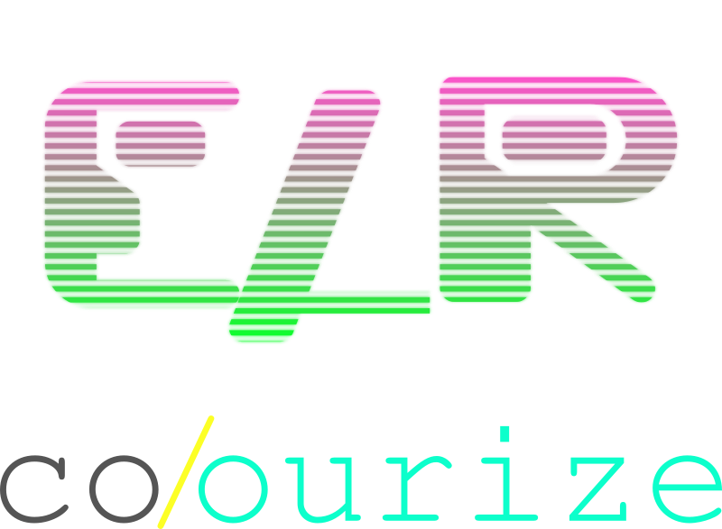
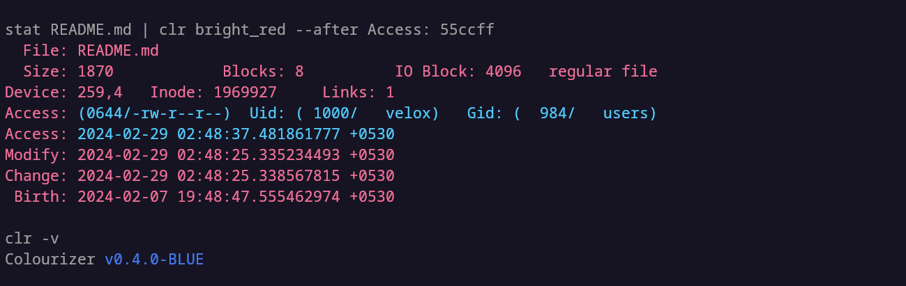

<div align="center">

Currently a work in progress

</img>

depends on [libclr](https://www.github.com/velox0/libclr)

<hr>
<p>colourise text based on string pattern</p>
</div>

# Overview

Colourizer allows you to easily colourise text streams based on specified string patterns. It is designed to provide a simple yet powerful way to add custom colors to different parts of your text.

# Usage

The program looks for specific strings specified after certain arguments such as `--after`, `--from`, and `--reset-on` and formats them with the specified color. Here's an example:

```bash
stat image.png | clr red --after ": " green --reset-on "  "
```

This command outputs the standard input in red. After encountering `: `, it formats the subsequent string in green. It then resets to red after encountering two consecutive spaces `  `.

By default, the color definitions are read from `~/.config/colourizer/preset`.

## Example

```bash
stat README.md | ./clr red --after velox green --from velox blue --from "+" cyan --after ": " green
```

</src>

# Customization

To customize color presets, you can modify the configuration file located at `~/.config/colourizer/preset`. This file defines the default color mappings.

# TODO

- [ ] fix kmp implementation
- [ ] config file support
- [ ] more string matching options:
  - [x] `--fromx`, `--afterx`; for hex colour
  - [ ] `--match`, `--matchx` only colour matching string

<em>Note: The tool is currently under development, and improvements are ongoing.</em>
